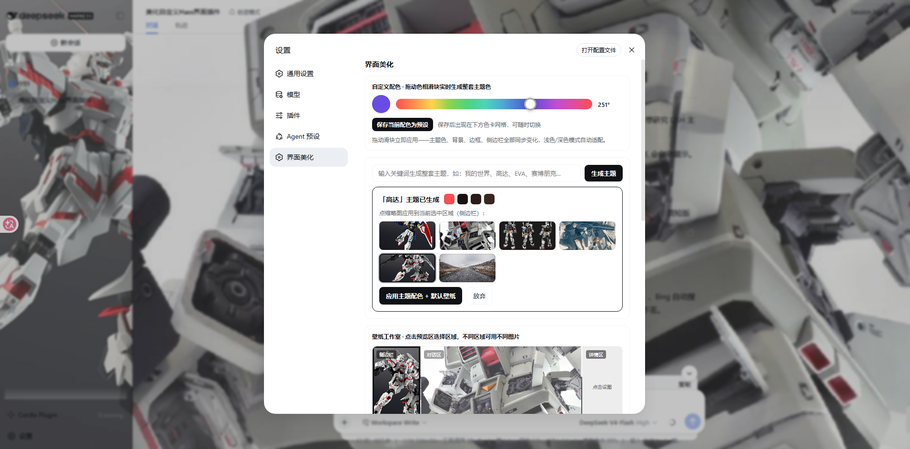
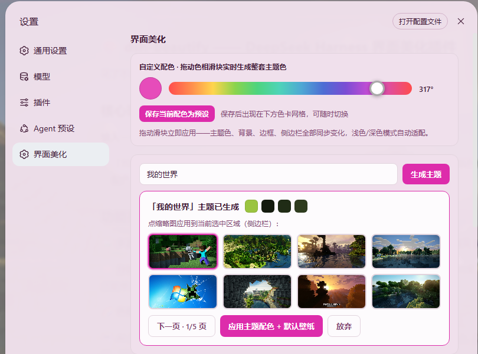
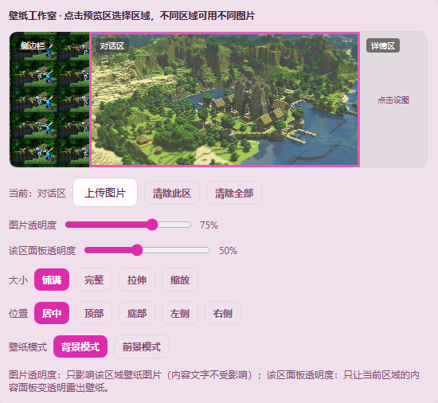
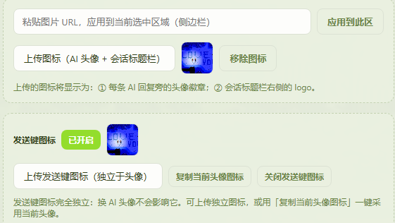

# dsh-beautify 🎨

A UI beautification plugin for **DeepSeek Harness (DSH)** — generate a complete theme from any keyword, with Bing wallpaper search, a per-region wallpaper studio, a hue slider, and an AI avatar/logo, turning the Harness chat interface into your own style.

> **中文**: [README.md](./README.md) · **Changelog**: [CHANGELOG.md](./CHANGELOG.md)

## 📸 Screenshots

> Placeholders: put screenshots into [`docs/screenshots/`](./docs/screenshots/) named `01-settings.png`, `02-theme-generator.png`, `03-wallpaper-studio.png`, `04-avatar-logo.png` to display them here.

| Settings (hue slider) | Keyword theme generator | Wallpaper studio | AI avatar + logo |
| --- | --- | --- | --- |
|  |  |  |  |

## ✨ Features

- **Keyword → full theme**: type "Minecraft", "Gundam", "starry night"… and get a complete color theme. 14 built-in themes (Minecraft / Gundam / Evangelion / Cyberpunk / Dark / Starry Night / Sakura / Forest / Ocean / Sunset / Mint / Vaporwave / Neon / Midnight); any other keyword generates a hash-based color scheme.
- **Bing wallpaper search**: keyword-related wallpapers are scraped from Bing image search and shown as a candidate list (server-side `node` subprocess scraping; the client probes each image's loadability).
- **Per-region wallpaper studio**: 4 regions — full background / sidebar / chat column / details column — each with its own image, opacity, size, and position; each region also has an **independent content-panel opacity** (transparent panels that reveal the wallpaper in just that region); paste an image URL or upload a local image (icon or wallpaper).
- **Hue slider custom colors**: drag to preview a complete theme in real time; save it as a preset.
- **AI avatar icon**: an uploaded icon is used as the AI reply avatar and the page logo.
- **Send-button icon**: the uploaded icon (or a dedicated one) can replace the default send arrow in the composer — one-click toggle.
- **Persistence**: all settings are stored in browser localStorage and restored after a refresh; one-click reset included.

## 📦 Two installation methods (pick one)

### Method A: Deployment-grade plugin (auto-start, recommended for long-term use)

#### 1. Copy the package

Copy the `dsh-beautify` folder from this repo into the DSH profile's dependencies:

```
<DSH_HOME>/.dsh/profiles/<profile>/node_modules/@local/dsh-beautify/
```

> e.g. `C:\Users\<you>\.dsh\profiles\web\node_modules\@local\dsh-beautify\`

#### 2. Register in the patch config

Edit `cordis.patch.yml` in the same directory and **append to the top-level list** (see `cordis.patch.example.yml`):

```yaml
- insert:
    - id: beautify
      name: '@local/dsh-beautify'
```

> ⚠️ Must be a top-level `insert` (without an `id` field), otherwise the patch is silently skipped because the group cannot be found.

#### 3. Restart DSH

After restart the plugin loads automatically — a "✨ 美化" entry appears at the bottom of the sidebar. No manual run needed.

### Method B: Dynamic plugin (quick trial / for developers, no config changes)

No file copying, no `cordis.patch.yml` edits, no restart — run it directly in the current session with `cordis_define` + `cordis_run`:

1. Open the [`dynamic/`](./dynamic/) directory
2. Paste [`dynamic/host.js`](./dynamic/host.js) into `cordis_define` → `code.host`
3. Paste [`dynamic/client.js`](./dynamic/client.js) into `code.client`
4. Run with `cordis_run` and approve

Settings entry: **Settings → 界面美化·动态版**. ⚠️ Dynamic plugins live only in process memory and need to be re-run after a DSH restart (complementary to the deployment version; see [`dynamic/README.md`](./dynamic/README.md)).

## 🛠 Prerequisites

- A DSH deployment (Web client)
- `node` available on `PATH` (wallpaper scraping uses a `node -e` subprocess)
- Network access to `www.bing.com` (image search scraping)

## ⚠️ Known limitations

- Wallpaper candidates are probed with browser `new Image()` and an 8-second timeout; some CDN image hosts may appear unavailable under rate limiting.
- Uploaded images become data URLs stored in localStorage; a single image over ~5MB may exceed the quota — paste a URL for large images instead.
- Server-side Bing scraping is unofficial; if Bing changes its page structure the candidate list may come back empty (it falls back to LoremFlickr / Picsum placeholders).

## 📁 File structure

```
dsh-beautify/
├── package.json              # plugin manifest (dsh.client injects slots / theme)
├── lib/
│   ├── index.js              # Host: /api/bfy-search endpoint, Bing scraping, theme generation
│   └── client.js             # Client: beautify settings page, wallpaper studio, avatar & logo
├── dynamic/                  # Dynamic-plugin version (cordis_define / cordis_run)
│   ├── host.js               #   dynamic Host (harness RPC)
│   ├── client.js             #   dynamic Client
│   └── README.md             #   dynamic version install guide
├── docs/screenshots/         # screenshots (placeholders)
├── README.en.md              # this English readme
├── CHANGELOG.md              # changelog
└── cordis.patch.example.yml  # deployment install config sample
```

## 🗂 API

`GET /api/bfy-search?q=<keyword>` — returns `{ ok, label, tokens, candidates }`, where `tokens` are light/dark token pairs ready for `theme.overrideTokens`, and `candidates` is a list of wallpaper candidate URLs. (The dynamic version exposes the same logic through the package-private RPC `bfy-search` instead of an HTTP route.)

## 📄 License

[MIT](./LICENSE)
